# 🔧 InsightsLM Troubleshooting Guide

**Last Updated:** November 10, 2025  
**Version:** 1.3.0

This guide helps you diagnose and fix common issues with InsightsLM.

---

## 📋 Quick Diagnostic Flowchart

```mermaid
flowchart TD
    Start([InsightsLM Issue]) --> AppLaunch{Does app<br/>launch?}
    
    AppLaunch -->|No| BackendCheck[Check Backend]
    AppLaunch -->|Yes| ModelIssue{Models<br/>loading?}
    
    BackendCheck --> WSLInstall{WSL2<br/>installed?}
    WSLInstall -->|No| InstallWSL[Install WSL2:<br/>wsl --install]
    WSLInstall -->|Yes| WSLRunning{WSL2<br/>running?}
    
    WSLRunning -->|No| StartWSL[Start WSL2:<br/>wsl ~]
    WSLRunning -->|Yes| CheckRepo{Repo<br/>exists?}
    
    CheckRepo -->|No| CloneRepo[Clone repository<br/>to ~/InsightsLM-new]
    CheckRepo -->|Yes| CheckVenv{venv<br/>exists?}
    
    CheckVenv -->|No| CreateVenv[Create venv:<br/>python3 -m venv venv]
    CheckVenv -->|Yes| CheckDeps{Dependencies<br/>installed?}
    
    CheckDeps -->|No| InstallDeps[Install dependencies:<br/>pip install -r requirements.txt]
    CheckDeps -->|Yes| ManualStart[Start backend manually:<br/>uvicorn main:app]
    
    ModelIssue -->|No| CheckProvider{Which<br/>provider?}
    ModelIssue -->|Yes| TranscribeIssue{Transcription<br/>working?}
    
    CheckProvider -->|Ollama| OllamaCheck{Ollama<br/>running?}
    CheckProvider -->|OpenAI| OpenAIKey[Check API key<br/>in Settings]
    CheckProvider -->|Anthropic| AnthropicKey[Check API key<br/>in Settings]
    CheckProvider -->|Google| GoogleKey[Check API key<br/>in Settings]
    
    OllamaCheck -->|No| StartOllama[Start Ollama service]
    OllamaCheck -->|Yes| ModelsInstalled{Models<br/>installed?}
    
    ModelsInstalled -->|No| PullModel[Install model:<br/>ollama pull llama3]
    ModelsInstalled -->|Yes| TestModel[Test in Settings tab]
    
    OpenAIKey --> TestAPI[Test API Connection<br/>in Settings]
    AnthropicKey --> TestAPI
    GoogleKey --> TestAPI
    
    TranscribeIssue -->|No| GPUCheck{Using<br/>GPU?}
    TranscribeIssue -->|Yes| ChatIssue{Chat/Summary<br/>working?}
    
    GPUCheck -->|Yes| CheckCUDA[Check CUDA setup:<br/>See docs/GPU_SETUP.md]
    GPUCheck -->|No| CPUOkay[CPU mode is normal<br/>but slower]
    
    ChatIssue -->|No| ModelTest[Test model<br/>in Settings]
    ChatIssue -->|Yes| ExportIssue{Export<br/>working?}
    
    ExportIssue -->|No| CheckFS[Check file system<br/>permissions]
    ExportIssue -->|Yes| AllGood[✅ Everything working!]
    
    InstallWSL --> Restart[Restart & Try Again]
    StartWSL --> Restart
    CloneRepo --> Restart
    CreateVenv --> Restart
    InstallDeps --> Restart
    ManualStart --> Restart
    StartOllama --> Restart
    PullModel --> Restart
    TestModel --> Restart
    TestAPI --> Restart
    CheckCUDA --> Restart
    CPUOkay --> Restart
    ModelTest --> Restart
    CheckFS --> Restart
    AllGood --> End([Done!])
    Restart --> End
    
    style Start fill:#e1f5ff
    style End fill:#c8e6c9
    style AllGood fill:#4caf50,color:#fff
    style AppLaunch fill:#fff3e0
    style ModelIssue fill:#fff3e0
    style TranscribeIssue fill:#fff3e0
    style ChatIssue fill:#fff3e0
    style ExportIssue fill:#fff3e0
```



---

## 🚨 Common Issues

### 1. Backend Won't Start

**Symptoms:**
- App launches but shows "Backend connection failed"
- Loading spinner doesn't stop
- Can't upload files

**Solutions:**

#### A. Check if WSL2 is running
```bash
# In PowerShell
wsl -l -v

# Should show "Running" for Ubuntu
```

If not running:
```powershell
wsl ~
```

#### B. Check if backend repository exists
```bash
# In WSL2
cd ~/InsightsLM-new
ls -la backend/

# Should show main.py, requirements.txt, etc.
```

#### C. Check if virtual environment exists
```bash
cd ~/InsightsLM-new/backend
ls -la venv/

# Should show bin/, lib/, etc.
```

If missing:
```bash
python3 -m venv venv
source venv/bin/activate
pip install -r requirements.txt
```

#### D. Start backend manually to see errors
```bash
cd ~/InsightsLM-new/backend
source venv/bin/activate
uvicorn main:app --host 0.0.0.0 --port 8000

# Watch for error messages
```

Common errors:
- **ModuleNotFoundError**: Run `pip install -r requirements.txt`
- **Port already in use**: Kill existing process or use different port
- **Permission denied**: Check file permissions with `ls -la`

---

### 2. No AI Models Available

**Symptoms:**
- Settings shows "No AI models available"
- Model dropdown is empty
- Can't generate summaries or chat

**Solutions:**

#### A. Ollama Models (Recommended for local use)

**Check if Ollama is running:**
```bash
# In PowerShell or Terminal
ollama list
```

If error "could not connect":
```bash
# Start Ollama service
# Windows: Ollama app should be running in system tray
# Mac: Ollama app should be running
# Linux: systemctl start ollama
```

**Install a model:**
```bash
ollama pull llama3
# or
ollama pull mistral
```

**Test the model:**
```bash
ollama run llama3
# Type: Hi
# Should respond immediately
```

#### B. OpenAI Models

1. Get API key from https://platform.openai.com/api-keys
2. In InsightsLM Settings tab:
   - Paste key in "OpenAI API Key" field
   - Click "Save API Keys"
   - Click "Test OpenAI Connection"

Common issues:
- **Invalid API key**: Double-check the key (starts with `sk-`)
- **No permissions**: Check account has API access enabled
- **Network error**: Check internet connection and firewall

#### C. Anthropic Claude Models

1. Get API key from https://console.anthropic.com/
2. In InsightsLM Settings tab:
   - Paste key in "Anthropic API Key" field
   - Click "Save API Keys"
   - Click "Test Anthropic Connection"

#### D. Google Gemini Models

1. Get API key from https://makersuite.google.com/app/apikey
2. In InsightsLM Settings tab:
   - Paste key in "Google Gemini API Key" field
   - Click "Save API Keys"
   - Click "Test Google Connection"

---

### 3. Model Not Working / "Model not found"

**Symptoms:**
- Model appears in dropdown
- Selecting it causes errors
- Error: "Model 'X' is not installed"

**This was fixed in Phase 6 V4!** If you're seeing this:

#### For Ollama Models:

**The Issue (Fixed):**
Models with tags (like `deepseek-r1:14b`) weren't being looked up correctly.

**The Fix:**
Update to latest version. The app now properly stores and uses full model names with tags.

**Manual Fix if needed:**
```bash
# List your installed models
ollama list

# Make sure the exact model name matches
ollama pull deepseek-r1:14b

# Test it works
ollama run deepseek-r1:14b
```

#### For Cloud Models:

**OpenAI/Anthropic/Google:**
The app now dynamically discovers available models. If a model doesn't work:

1. Test the API connection in Settings
2. Check your account has access to that model
3. Try a different model from the same provider

---

### 4. Transcription Fails or is Very Slow

**Symptoms:**
- Upload succeeds but transcription times out
- Very slow transcription (>10 minutes for 5-minute audio)
- Error: "Transcription failed"

**Solutions:**

#### A. Check Audio File
- **Supported formats**: MP3, MP4, WAV, M4A, WEBM
- **Max size**: 200 MB (recommended < 100 MB)
- **Duration**: Up to 2 hours

If file is too large:
```bash
# Convert to MP3 with compression (requires ffmpeg)
ffmpeg -i input.wav -ar 16000 -ac 1 -b:a 64k output.mp3
```

#### B. Check GPU Acceleration (WSL2 only)

**Is GPU being used?**
```bash
# In WSL2 backend terminal
# Look for these messages when transcription starts:
# "Using CUDA GPU for transcription"  ← Good!
# "Using CPU for transcription"      ← Slow

# Check CUDA availability
python3 -c "import torch; print(torch.cuda.is_available())"
# Should print: True
```

**If GPU not working:**
See [docs/GPU_SETUP.md](./docs/GPU_SETUP.md) for complete setup guide.

**Performance expectations:**
- **GPU (CUDA)**: 15-20x real-time (16-min audio in ~50 seconds)
- **CPU**: 1-2x real-time (16-min audio in ~8-16 minutes)

#### C. Memory Issues

If transcription crashes:
```bash
# Check available memory
free -h

# If low, close other applications
# GPU: Need 2-6 GB VRAM free
# CPU: Need 4-8 GB RAM free
```

---

### 5. Chat/Summary Not Working

**Symptoms:**
- Transcription works
- But chat responses fail
- Or summary generation fails

**Solutions:**

#### A. Check Model Selection
1. Go to Summary or Overview tab
2. Check model dropdown has a selection
3. Try a different model

#### B. Test Model Connection
1. Go to Settings tab
2. Click "Test All Connections"
3. Look for specific error messages:
   - **Ollama not running**: Start Ollama
   - **Invalid API key**: Re-enter key
   - **Model not found**: Install model

#### C. Check for Error Details
Open browser DevTools (F12):
```
1. Console tab → Look for red errors
2. Network tab → Look for failed requests (red)
3. Check response messages
```

Common errors:
- **429**: Rate limited (wait or use different key)
- **401**: Invalid API key
- **500**: Backend error (check backend logs)

---

### 6. Export Not Working

**Symptoms:**
- Export buttons don't respond
- Save dialog doesn't open
- Error: "Failed to save file"

**Solutions:**

#### A. Check File Permissions
**Windows:**
```powershell
# Make sure Downloads folder exists and is writable
Test-Path $env:USERPROFILE\Downloads
```

**Linux/Mac:**
```bash
ls -la ~/Downloads
# Should show rwx permissions
```

#### B. Try Different Export Location
1. Click Export
2. In save dialog, navigate to different folder
3. Try Desktop or Documents

#### C. Check Disk Space
```powershell
# Windows
Get-PSDrive C
```

```bash
# Linux/Mac
df -h ~
```

Need at least 100 MB free for exports.

---

### 7. Settings Won't Save

**Symptoms:**
- API keys don't persist
- Settings reset after restart
- "Failed to save configuration"

**Solutions:**

#### A. Check Config Directory
```bash
# WSL2
ls -la ~/.local/share/InsightsLM/
# Should show: insightslm.db, chroma_db/

# If missing:
mkdir -p ~/.local/share/InsightsLM
```

**Windows:**
```powershell
$env:LOCALAPPDATA\InsightsLM
# Should exist
```

#### B. Check Database Integrity
```bash
# WSL2
cd ~/.local/share/InsightsLM
sqlite3 insightslm.db "PRAGMA integrity_check;"
# Should output: ok
```

If corrupted:
```bash
# Backup old database
mv insightslm.db insightslm.db.backup

# Restart app - will create new database
```

#### C. File Permissions
```bash
# WSL2
ls -la ~/.local/share/InsightsLM/insightslm.db
# Should show: rw- (readable and writable)

# If not:
chmod 600 ~/.local/share/InsightsLM/insightslm.db
```

---

## 🧹 Clean Install / Reset

If all else fails, try a clean reinstall:

### Windows Native Backend (Easier)
```powershell
# 1. Close InsightsLM completely

# 2. Delete data directory
Remove-Item -Recurse -Force "$env:LOCALAPPDATA\InsightsLM"

# 3. Reinstall dependencies
cd C:\Users\YourName\Projects\InsightsLM-new\backend
python -m venv venv
.\venv\Scripts\Activate.ps1
pip install -r requirements.txt

# 4. Restart InsightsLM
```

### WSL2 Backend (Current Default)
```bash
# 1. In WSL2, backup any important data
cd ~/.local/share/InsightsLM
tar -czf ~/insightslm-backup-$(date +%Y%m%d).tar.gz .

# 2. Remove data directory
rm -rf ~/.local/share/InsightsLM

# 3. Remove database and vector store
rm insightslm.db
rm -rf chroma_db/

# 4. Restart backend
cd ~/InsightsLM-new/backend
source venv/bin/activate
uvicorn main:app --host 0.0.0.0 --port 8000
```

The app will recreate all necessary files on next launch.

---

## 🔍 Advanced Debugging

### Check Backend Logs
```bash
# WSL2 - Backend logs appear in terminal where you started uvicorn
cd ~/InsightsLM-new/backend
source venv/bin/activate
uvicorn main:app --host 0.0.0.0 --port 8000 --log-level debug

# Watch for errors during operations
```

### Check Frontend Logs
1. Launch InsightsLM
2. Press **F12** to open DevTools
3. Go to **Console** tab
4. Look for errors (red text)
5. Copy error message for support

### Test API Directly
```bash
# Health check
curl http://localhost:8000/health

# Get all models
curl http://localhost:8000/models/all

# Test Ollama specifically
curl http://localhost:8000/test-api/ollama
```

### Check Network Connectivity
```bash
# Can frontend reach backend?
curl http://localhost:8000/health

# Should return: {"status":"healthy","version":"1.2.0"}
```

### Python Environment Issues
```bash
# WSL2 - Check Python version
python3 --version
# Need: Python 3.10+

# Check if dependencies are installed
pip list | grep fastapi
pip list | grep faster-whisper

# Reinstall if missing
pip install -r requirements.txt --break-system-packages
```

---

## 🆘 Still Having Issues?

If none of these solutions work:

### 1. Gather Debug Information

```bash
# System info
uname -a  # Linux/WSL
systeminfo  # Windows

# Python environment
python3 --version
pip list

# GPU info (if using)
nvidia-smi  # Should show GPU
```

### 2. Create GitHub Issue

Go to: https://github.com/JoseAndresCamachoGuadamuz/InsightsLM/issues

Include:
- Operating system
- Error message (exact text)
- Steps to reproduce
- Screenshots if helpful
- Backend/frontend logs

### 3. Email Support

**Contact:** joseandrescamachoguadamuz@gmail.com

Include:
- Description of issue
- What you've already tried
- Any error messages
- System information

---

## ✅ Preventive Maintenance

### Regular Checks

**Weekly:**
- Update Ollama models: `ollama pull llama3`
- Check disk space: `df -h`
- Verify API keys still work (test in Settings)

**Monthly:**
- Update dependencies:
  ```bash
  cd ~/InsightsLM-new/backend
  source venv/bin/activate
  pip install --upgrade -r requirements.txt
  ```
- Check for InsightsLM updates on GitHub
- Backup important transcripts/reports

**As Needed:**
- Clear old transcripts to save space
- Rotate API keys for security
- Update GPU drivers (if using GPU acceleration)

---

## 📚 Additional Resources

- **Setup Guide**: [SETUP_GUIDE.md](./SETUP_GUIDE.md)
- **User Guide**: [USER_GUIDE.md](./USER_GUIDE.md)
- **GPU Setup**: [docs/GPU_SETUP.md](./docs/GPU_SETUP.md)
- **API Reference**: [docs/API_REFERENCE.md](./docs/API_REFERENCE.md)
- **GitHub Issues**: [Report a Bug](https://github.com/JoseAndresCamachoGuadamuz/InsightsLM/issues)

---

**Last Updated:** November 10, 2025  
**Version:** 1.3.0  
**Maintained by:** José Andrés Camacho Guadamuz
