# 📊 Phase 6: Dynamic Model Loading - Complete Documentation

**Implementation Date:** November 10, 2025  
**Version:** V4 (Final Fix)  
**Status:** ✅ Production Ready

---

## 🎯 Overview

Phase 6 implements **fully dynamic AI model discovery** across all four providers (Ollama, OpenAI, Anthropic, Google Gemini), eliminating hardcoded model lists and enabling support for any installed or accessible model without code changes.

### **The Problem We Solved**

**Before Phase 6:**
- Hardcoded `SUPPORTED_MODELS` dictionary limited available models
- Adding new models required code changes
- Models with tags (e.g., `deepseek-r1:14b`) didn't work
- No visibility into why providers failed

**After Phase 6 V4:**
- ✅ Dynamic discovery - all installed/accessible models work immediately
- ✅ Full model name support including tags
- ✅ Provider-specific error messages
- ✅ Graceful degradation when providers are unavailable

---

## 🏗️ Architecture

### System Overview


### Model Discovery Flow

```mermaid
sequenceDiagram
    participant UI as Frontend UI
    participant API as API Client
    participant Backend as Backend /models/all
    participant Ollama as Ollama Discovery
    participant OpenAI as OpenAI Discovery
    participant Anthropic as Anthropic Discovery
    participant Google as Google Discovery
    
    UI->>API: fetchAvailableModels()
    activate API
    
    API->>Backend: GET /models/all
    activate Backend
    
    Backend->>Ollama: get_ollama_models()
    activate Ollama
    
    alt Ollama Available
        Ollama->>Ollama: Query ollama.list()
        Ollama->>Ollama: Format with tags
        Ollama-->>Backend: [models with full names]
    else Ollama Unavailable
        Ollama-->>Backend: Error: "Ollama not running"
    end
    deactivate Ollama
    
    Backend->>OpenAI: get_openai_models()
    activate OpenAI
    
    alt API Key Valid
        OpenAI->>OpenAI: Query openai.models.list()
        OpenAI->>OpenAI: Filter GPT models
        OpenAI-->>Backend: [GPT models]
    else No API Key / Invalid
        OpenAI-->>Backend: Error: "Invalid API key"
    end
    deactivate OpenAI
    
    Backend->>Anthropic: get_anthropic_models()
    activate Anthropic
    
    alt API Key Present
        Anthropic->>Anthropic: Return known models
        Anthropic-->>Backend: [Claude models]
    else No API Key
        Anthropic-->>Backend: []
    end
    deactivate Anthropic
    
    Backend->>Google: get_google_models()
    activate Google
    
    alt API Key Valid
        Google->>Google: Query genai.list_models()
        Google->>Google: Filter generation models
        Google-->>Backend: [Gemini models]
    else No API Key / Invalid
        Google-->>Backend: Error: "Invalid API key"
    end
    deactivate Google
    
    Backend->>Backend: Aggregate all models
    Backend->>Backend: Collect provider errors
    
    Backend-->>API: {models: [...], provider_errors: {...}}
    deactivate Backend
    
    API->>API: Update availableModels state
    API->>API: Display provider errors
    API->>UI: Render model dropdowns
    deactivate API
```



### V4 Fix: Full Model Name Resolution


---

## 🔧 Implementation Details

### Backend Changes

#### 1. Removed Hardcoded Models

**File:** `backend/services/llm_service.py`

**Before (Lines 15-20):**
```python
SUPPORTED_MODELS = {
    "ollama_mistral": "mistral",
    "ollama_llama3": "llama3",
    # ... hardcoded list
}
```

**After V3 (Line 17):**
```python
# SUPPORTED_MODELS dictionary removed in V3 fix
# Model validation now happens dynamically in generate_response()
```

#### 2. Enhanced Ollama Discovery (V4 FIX)

**File:** `backend/services/llm_service.py`  
**Function:** `get_ollama_models()` (Lines 119-188)

**Key Change (Line 166):**
```python
formatted_models.append({
    'key': model_key,
    'label': model_label,
    'provider': 'ollama',
    'model_name': model.model  # 🔧 V4 FIX: Store full name with tag
})
```

**Example:**
- **Model installed:** `deepseek-r1:14b`
- **Key generated:** `ollama_deepseek_r1`  
- **Label:** "Ollama: Deepseek-r1"
- **model_name stored:** `deepseek-r1:14b` ← Full name with tag!

#### 3. Dynamic Model Resolution

**File:** `backend/services/llm_service.py`  
**Function:** `generate_response()` (Lines 742-842)

**V4 Implementation (Lines 763-779):**
```python
if model_key.startswith("ollama_"):
    # Query available models to get full name with tag
    available_models = get_ollama_models()
    
    # Find the model by key
    model_info = next((m for m in available_models if m['key'] == model_key), None)
    
    if not model_info:
        raise ValueError(
            f"Ollama model '{model_key}' is not available. "
            "Please check installed models with: ollama list"
        )
    
    # Use the full model name with tag (e.g., "deepseek-r1:14b")
    full_model_name = model_info['model_name']
    logger.info(f"Using provider: ollama, model: {full_model_name}")
    return _call_ollama(full_model_name, prompt)
```

**Why This Works:**
1. User selects `ollama_deepseek_r1` from dropdown
2. Backend calls `get_ollama_models()` to get current installed models
3. Finds `model_info` where `key == "ollama_deepseek_r1"`
4. Extracts `model_name == "deepseek-r1:14b"`
5. Calls Ollama API with full name including tag
6. ✅ Model works!

#### 4. Provider Error Collection

**File:** `backend/services/llm_service.py`  
**Function:** `get_all_available_models()` (Lines 379-456)

**Implementation (Lines 402-412):**
```python
# 1. Ollama (local)
try:
    ollama_models = get_ollama_models()
    all_models.extend(ollama_models)
except ValueError as e:
    # Store user-friendly error message
    provider_errors['ollama'] = str(e)
    logger.info(f"Ollama unavailable: {e}")
except Exception as e:
    provider_errors['ollama'] = "Ollama service error. Please check Ollama installation."
    logger.warning(f"Unexpected Ollama error: {e}")
```

**Returns:**
```python
{
    "models": [
        {"key": "ollama_llama3", "label": "Ollama: Llama3", ...},
        {"key": "openai_gpt_4o", "label": "OpenAI: GPT-4O", ...}
    ],
    "provider_errors": {
        "anthropic": "Anthropic API key is invalid. Please check your key in Settings.",
        "google": "Unable to connect to Google Gemini. Please check your internet connection."
    }
}
```

### Frontend Changes

#### 1. Dynamic Model State

**File:** `frontend/src/App.tsx`  
**Lines:** 114-116

```typescript
const [availableModels, setAvailableModels] = useState<ModelInfo[]>([]);
const [modelsLoading, setModelsLoading] = useState<boolean>(false);
const [modelsError, setModelsError] = useState<string>('');
```

#### 2. Model Fetching

**File:** `frontend/src/App.tsx`  
**Function:** `fetchAvailableModels()` (Lines 366-450)

**Key Implementation:**
```typescript
const fetchAvailableModels = async () => {
    setModelsLoading(true);
    setModelsError('');
    
    try {
        const response = await getAllModels();
        const models = response.data.models;
        const providerErrors = response.data.provider_errors;
        
        if (models && models.length > 0) {
            setAvailableModels(models);
            
            // Display provider-specific errors
            if (providerErrors && Object.keys(providerErrors).length > 0) {
                // Build user-friendly error message
                let message = '⚠️ Some AI providers are unavailable: ';
                // ... format errors for toast notification
                showToastNotification(message);
            }
            
            // Auto-select first available if current model unavailable
            const currentModelExists = models.some(m => m.key === selectedModel);
            if (!currentModelExists && models.length > 0) {
                setSelectedModel(models[0].key);
            }
        }
    } catch (error) {
        setModelsError('Unable to fetch models. Please check your connection.');
    } finally {
        setModelsLoading(false);
    }
};
```

#### 3. Dynamic Model Dropdowns

**File:** `frontend/src/App.tsx`  
**Lines:** 1271-1273 (Summary), 1443-1444 (Reports)

```tsx
{availableModels.map(model => (
    <option key={model.key} value={model.key}>
        {model.label}
    </option>
))}
```

### Path Update

**File:** `frontend/src/main.ts`  
**Line:** 56

**Change:**
```typescript
const wslCommand = `cd ~/InsightsLM-new/backend && source venv/bin/activate && uvicorn main:app --host 0.0.0.0 --port ${port}`;
```

Updated repository path from `InsightsLM` to `InsightsLM-new`.

---

## 🎯 Benefits

### 1. Zero Configuration for New Models

**Before:**
```python
# Had to add to SUPPORTED_MODELS
SUPPORTED_MODELS["ollama_gemma2"] = "gemma2"
# Restart backend
```

**After:**
```bash
# Just install the model
ollama pull gemma2

# Restart frontend - model appears automatically!
```

### 2. Full Tag Support

**Before:**
```
deepseek-r1:14b  ❌ Not found - only "deepseek-r1" was looked up
deepseek-r1:7b   ❌ Not found - only "deepseek-r1" was looked up
```

**After:**
```
deepseek-r1:14b  ✅ Works - full name stored and used
deepseek-r1:7b   ✅ Works - different tag, different model
```

### 3. Better User Experience

**Before:**
```
Error: Model not found
```

**After:**
```
⚠️ Some AI providers are unavailable:
Ollama: Ollama is not running. Please start Ollama to use local models.
OpenAI: OpenAI API key is invalid. Please check your key in Settings.
✅ Working: Anthropic (3), Google (5)
```

### 4. Graceful Degradation

- App works with ANY combination of available providers
- Frontend shows which providers are working
- Clear error messages guide users to fix issues
- No provider is required - use what you have!

---

## 🧪 Testing Results

### Test 1: All Four Ollama Models

**Models Tested:**
1. `llama3:latest` ✅
2. `mistral:latest` ✅  
3. `gemma:latest` ✅
4. `deepseek-r1:14b` ✅ ← **The V4 Fix Target!**

**Results:**
- All models discovered correctly
- Full names with tags stored properly
- All models work in Summary, Chat, Overview, Reports
- ✅ **DeepSeek-R1 14B parameter model works perfectly!**

### Test 2: Mixed Provider Availability

**Scenario:** Ollama (4 models), Anthropic (3 models), OpenAI/Google unavailable

**Result:**
```
✅ 7 models available
⚠️ Toast: "Some AI providers are unavailable: 
OpenAI: OpenAI API key not configured. 
Google: Google Gemini API key not configured. 
| ✅ Working: Ollama (4), Anthropic (3)"
```

### Test 3: No Providers Available

**Scenario:** Ollama not running, no API keys configured

**Result:**
```
⚠️ Toast: "No AI models available.
Ollama: Ollama is not running. Please start Ollama to use local models.
OpenAI: OpenAI API key not configured.
Anthropic: Anthropic API key not configured.
Google: Google Gemini API key not configured."
```

---

## 📊 Performance Impact

### Model Discovery Overhead

| Provider | Discovery Time | Cached? |
|----------|---------------|---------|
| **Ollama** | ~50ms | No (local, fast) |
| **OpenAI** | ~300ms | No (network) |
| **Anthropic** | ~5ms | Yes (static list) |
| **Google** | ~400ms | No (network) |

**Total:** ~755ms on first load (acceptable for startup)

### Model Lookup Overhead

**Per AI Request:**
- V3 (Before V4): ~1ms (simple string extraction)
- V4 (After Fix): ~50ms (query + lookup)

**Tradeoff:** +49ms per request, but **guarantees correctness** for all models including tags.

---

## 🚀 Future Enhancements

### Potential Improvements

1. **Model Caching**
   - Cache discovery results for 5 minutes
   - Reduce repeated API calls
   - Add manual refresh button

2. **Model Metadata**
   - Show model size (e.g., "7B", "14B", "70B")
   - Show quantization (e.g., "Q4_K_M")
   - Show context window size

3. **Smart Model Selection**
   - Remember last used model per feature
   - Suggest best model for task type
   - Auto-select fastest available model

4. **Provider Status Indicators**
   - Visual indicators in Settings (🟢🔴⚪)
   - Real-time connection monitoring
   - Auto-refresh on reconnection

---

## 📝 Migration Guide

### For Existing Installations

**No action required!** Phase 6 V4 is backward compatible.

**But you might want to:**

1. **Update Model Names** (Optional)
   - Old: Selected "Ollama: Llama3"
   - New: May now show "Ollama: Llama3" or "Ollama: Llama3.3" depending on installed version
   - Models will auto-switch to first available if old selection not found

2. **Install More Models** (Recommended)
   ```bash
   ollama pull gemma
   ollama pull qwen2.5
   ollama pull deepseek-r1:14b
   ```
   They'll appear immediately after restart!

3. **Test Provider Connections**
   - Go to Settings → Test All Connections
   - See which providers work
   - Fix any issues (add API keys, start Ollama, etc.)

---

## 🐛 Known Issues & Fixes

### Issue 1: Model List Not Refreshing

**Symptoms:** New model installed but doesn't appear

**Fix:**
1. Click Settings tab
2. Click "Test Ollama Connection"
3. Model list will refresh automatically

**Or:** Restart frontend application

### Issue 2: Wrong Model Selected After Restart

**Symptoms:** App selects different model than last used

**Cause:** Last used model no longer available

**Fix:** Auto-selects first available model (by design)

### Issue 3: Slow Initial Load

**Symptoms:** 3-5 second delay on first app launch

**Cause:** Discovering models from all providers

**Fix:** Normal behavior - subsequent loads are faster

---

## 📚 Related Documentation

- **Setup Guide**: [SETUP_GUIDE.md](../SETUP_GUIDE.md)
- **API Reference**: [API_REFERENCE.md](./API_REFERENCE.md)
- **Troubleshooting**: [TROUBLESHOOTING.md](../TROUBLESHOOTING.md)
- **Architecture**: [ARCHITECTURE.md](./ARCHITECTURE.md)

---

## 👤 Author & Contact

**José Andrés Camacho Guadamuz**

- GitHub: [@JoseAndresCamachoGuadamuz](https://github.com/JoseAndresCamachoGuadamuz)
- Email: joseandrescamachoguadamuz@gmail.com

---

**Phase 6 V4 Status:** ✅ **Complete & Production Ready**  
**Last Updated:** November 10, 2025  
**Next Phase:** TBD
